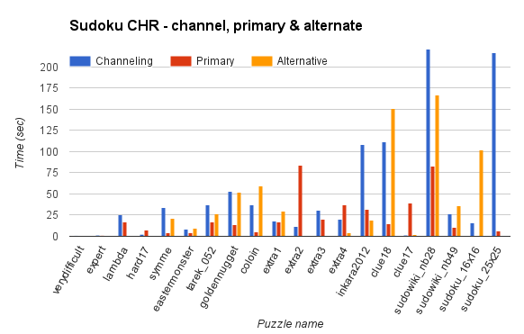

% Report: Advanced Programming Languages in Artificial Intelligence
% Pablo Bollansée [r0465328], Vincent Tanghe [r0294173]
% \today

*__Note:__ This will be parsed to pdf in Pandoc later - though image references can be nice D:*

# INTRODUCTION

Constraint Logic Programming (CLP) is an augmentation of the logic programming paradigm where relations between variables are specified with constraints.
It can be seen as an extension that brings relational arithmetic to Prolog.

For the course Advanced Programming Languages in Artificial Intelligence, we are given the opportunity to get real experience with some CLP languages.
The goal of this assignment is to get practical experience with different CLP languages and to get a deeper understanding in how they work.
This will be done by solving two different puzzle games with the languages two of three thought languages: _ECLiPSe_, _Constraint Handling Rules_ (_CHR_) and _Jess_.

First we will do a short discussion of the CLP languages, explaining which we chose and why.
We then discuss of our solver for the popular puzzle game Sudoku in both chosen languages, followed by a discussion our approach for solving Shikaku.
Finally we will end with a conclusion regarding the assignment as a whole.

# Constraint Programming languages

## ECLiPSE

_ECLiPSe_ is an Open-Source, Prolog-based system for the development and deployment of Constraint Programming applications.
It is largely backwards compatible with Prolog, which means that a large set of the Prolog libraries are still be available.
It also includes its own development environment _TkEclipse_, which includes some tools for debugging.
It also has a fairly active community, which means that questions asked on popular forums (e.g. StackOverflow) will get answered within a reasonable amount of time.

_ECLiPSe_ extends Prolog by providing a core language for specifying constraints and relations between variables.
It also introducing new data types and structures such as arrays and for-loops, which make the programming easier even though for-loops in a declarative language might seem weird.
It is declarative, easy to understand and it has a built-in search mechanism that supports many different parameters.
The running time, however, is highly dependent on the selected parameters (which define the heuristics used during the search).
Because of its slight differences with Prolog and the way it handles lists, it can be confusing for programmers that are new to the language.
Debugging can be a troublesome, as with any declarative language as there isn't always a clear path trough the code, however the _TkEclipse_ debugging tools relieve this problem a bit.

_ECLiPSe_ can be run using a more traditional command-line interface or a more interactive Graphical User Interface (GUI) tkeclipse.
But don't let the looks deceive you, the GUI works fairly well.

### Our first choice

_ECLiPSe_ is the first language we chose for this assignment.

*__note__ Meer uitleg over waarom we eclipse gekozen hebben en de voor/nadelen voor sudoku/shikaku*

## CHR

Constraint Handling Rules (CHR) allows for multiple rules to be defined in a certain order to simplify and propagate of multi-relation sets.
It also allows you to define redundant rules that may further simplify the possibility space.
CHR consists of multiple head atoms, followed by guarded rules.

CHR is available in different languages, such as Java, Haskell and C.
However, we will use the recommended Prolog implementation (SWI-prolog), which also means the SWI-Prolog editor and several prolog libraries become available.
CHR is free to download and has some online tutorials.
Unfortunately, most of them refer to exactly the same examples.

### Our second choice

CHR is the second language we chose for this assignment.

*__note__ Meer uitleg over waarom we CHR gekozen hebben en de voor/nadelen voor sudoku/shikaku*

## Jess

Jess is a rule engine for the Java platform. It has a GUI based on the open-source Eclipse IDE, which -in combination with friendly user-friendly error messages, should make the development easier. It is free for academic use, but a license is needed for commercial use. And it uses its own declarative XML language (JessML) which offers a lot of the Java perks, such as regular expressions and Java object manipulation.

However, the minor amount of available documentation, the trouble to get a working installation, the fact that it had not yet been introduced to us at the time of coding and the fact that it uses yet another language (JessML) instead of the already known Prolog syntax made Jess a less practical choice.
Besides these practicalities, we found that both Jess and CHR are good for expressing rules, but have a lesser support for search compared to _ECLiPSe_. We found that this is even worse for Jess, where delegating to host language (Java) is a common implementation.

*__note__ Meer uitleg over waarom we niet voor Jess gekozen hebben*

# SUDOKU

## TASK-DESCRIPTION
Sudoku is a logic puzzle game with a board that consists of a field with N x N blocks consisting of a N x N grid. For example, one 3x3 blocks contains all numbers from 1 to 9. The whole grid consists of 9 blocks, where each column and each row should contain all numbers from 1 to 9.

In this part we will discuss the implementation of our solver for Sudoku in _ECLiPSe_ and CHR.

## VIEWPOINTS AND PROGRAMS
The __classical viewpoint__ for Sudoku states that all numbers in a row must be different, that all numbers in a column must be different and that all numbers in a block must be different. In this viewpoint, it comes down to mapping numbers to places.

We propose an __alternate viewpoint__ where we map places, or coordinates, to the numbers. In this viewpoint, no coordinates can be double, each list should contain N coordinates (with N² being the width of the Sudoku) and each list must contain a coordinate from each block of the field.

To combine both viewpoints, we used __channeling__ by linking the board variables to both implementations.

## EXPERIMENTS SET-UP
To make the testing easier, we created a file "sudoku_eclipse_channeling" where the classical viewpoint, the alternate viewpoint and a combination using channeling can be called.
The file defines a method solve_all which/0 which will loop over all the different Sudokus defined in the sudex_toledo, using default channeling method. You can also solve a specific puzzle by using solve/2 using the puzzle name and model (simple, alt or both) as arguments.
Every time a solve method is called, the name of the method, name of the puzzle, running time, backtracks and solution is outputted.

Besides using **ECLiPSE**, we also build a solver in **CHR** instead of **Jess**.
The superior amount of documentation, the fact that we had seen an introduction of CHR when we started coding an alternative and the fact that it uses SWI-prolog made it the most practical choice.
Besides these practicalities, we found that both Jess and CHR are good for expressing rules, but have a lesser support for search compared to *ECLiPSE*. We found that this is even worse for Jess, where delegating to host language (Java) is a common implementation.

*__Note:__ We implemented this to work for any NxN Sudokus. This was not obliged by the assignment but gave a nice extra dimension. (pun intended)*

## RESULTS
**ECLiPSE**

Image XXX: Results of Sudoku ECLiPSE alternate implementation

Image XXX: Comparison between ECLiPSE and Channeling

**CHR**

Image XXX: Results of Sudoku CHR implementation. _Note II: we cut off the Channeling at 200 sec in soduwiki_nb28 (with a value of 938,76 sec) deformed the chart. Note II: the alternative version wasn't able to solve the 25x25 within a reasonable time._

## DISCUSSION
**The _ECLiPSe_ implementation:**

We can see that the classical view is faster than the other methods. However, there is one puzzle (Extra 2) where the power of channeling really does speed up the process.
We can also noticed that only the classical viewpoint uses backtracks.
It could also mean that the constraints are stronger in the alternate and with channeling, meaning that only the correct numbers are found for each cell. But, because of the long running times, we think that there could be ghost backtracks which are not captured by the program.

**The *CHR* implementation:**

We can immediately see that the results of CHR are a lot slower than those from _ECLiPSe_. But, there are some exceptions where the alternative in CHR performs better (e.g. Clue 17). We can see that the most difficult problems remain the same for both CHR and _ECLiPSe_ (e.g. sudowiki_nb28) and that in both cases the alternative outperforms the simple at extra2. Because of the high amount of backtracks in _ECLiPSe_ and inferences in CHR, we assume this has to do with the order of the propagation being less favorable.

**Conclusion**

The first thing we notice, solely based on our experiments, is that the implementation in _ECLiPSe_ is way faster than the CHR implementation. The combination with channeling is slower than CHR but only in one case faster than the _ECLiPSe_ implementation.

Personally, we felt it was easier to implement in _ECLiPSe_ rather than CHR.

# SHIKAKU

## TASK-DESCRIPTION
Shikaku is a puzzle game where the board consists of a grid with some numbers filled in. To solve the puzzle, you need to transform each number into a square with a surface that equals the number, without overlap, until the whole board is filled.

In this part we will discuss the implementation of our solver for Shikaku in _ECLiPSe_ and CHR.

## VIEWPOINTS AND PROGRAMS
The __classical viewpoint__ for Shikaku states that all squares -defined by a top-left coordinate, a width and height- must be inside the grid, contain the area of the given points and can't overlap.
We defined them as rect(Point, c(X,Y))

We propose an __alternate viewpoint__ (alt) where instead of one top-left coordinate, we define the top, left, bottom and right by a Y, X Y and X coordinate respectively. We know that another viewpoint was not part of the assignment, but we noticed that this alternate viewpoint greatly improved the overall performance.

## EXPERIMENTS SET-UP
The set-up is similar as in  the Sudoku set-up, whereas here we didn't do channeling and the puzzles are in a different file (puzzles.pl).
When opening the CHR or eclipse implementation in the correct GUI, the solve/1 or solve_all/0 predicates can be used to solve a specific or all puzzles respectively.

## RESULTS
**_ECLiPSe_**

Image XXX: Results of Shikaku _ECLiPSe_ implementation up to problem p(4,5) and with p(4,1) cutoff (original value: 5,382) and p(4,5) (original value: 2,668)

Puzzle | Normal time (sec) | Normal backtracks | Alt time (sec) | Alt backtracks
-------|------------------:|------------------:|---------------:|---------------:
p(5,1) | 22,090            | 2913              | 0,109          | 0
p(5,2) | 124,551           | 11754             | 0,125          | 0
p(5,3) | 201,616           | 32366             | 0,078          | 0
p(5,4) | 5,085             | 555               | 0,125          | 0
p(5,5) | 350,956           | 25996             | 0,187          | 1
p(6,1) | 177,872           | 4330              | 0,297          | 0
Table XXX: The last 6 results of Shikaku _ECLiPSe_ with the normal and the alternate viewpoint

**_CHR_**

Image XXX: Results of Shikaku CHR implementation up to problem p(4,5)

Puzzle | Normal time (sec) | Normal inferences | Alt time (sec) | Alt inferences
-------|------------------:|------------------:|---------------:|---------------:
p(5,1) | 11,668            | 82 663 847        | 10,000         | 98 574 181
p(5,2) | 13,400            | 95 476 199        | 11,335         | 112 089 372
p(5,3) | 44,311            | 273 118 213       | 193,563        | 2 280 734 323
p(5,4) | 12,982            | 92 899 324        | 11,068         | 108 855 366
p(5,5) | 57,242            | 366 411 206       | 63,839         | 725 171 392
p(6,1) | 156,980           | 982 498 648       | 124,253        | 1 354 737 953
Table XXX: The last 6 results of Shikaku CHR with the normal and the alternate viewpoint

## DISCUSSION

Because the last 6 methods had the highest time values, we cut them off and put them in a table to keep the chart ratio. By putting them in a table, we could add the backtracks or inferences respectively.

**The _ECLiPSe_ implementation:**

**Mssn nog iets over: https://docs.google.com/spreadsheets/d/104v0hoB6St5OcGLtnciMYNh6vDZ2OritDcx8gM066NI/edit#gid=1346877380**

We can see that the alternative view is much faster than the other methods. We can also see that it contains much less backtracks, which makes it seem that the constraints are tighter in the alternative model. Which is what we believe to be the main reason for the difference in speed.

Another reason for their difference in the search tree is that there are simply different values to be found.

**The *CHR* implementation:**

Again, the CHR implementation is slower than the _ECLiPSe_, until we reach problem p(5,1) where we see that the CHR implementation is faster than the normal viewpoint of the _ECLiPSe_ implementation.

in CHR we also see that the alternative viewpoint is usually faster than the normal viewpoint. However, it is interesting to see that in CHR the difference between the different viewpoints is **much** smaller!

Another interesting thing we notice, is that the amount of inferences does not necessary reflect the time needed. A larger amount of inferences is usually in line with a longer time. But we can see that the amount of inferences in the alternative seems higher while it does achieve lower times.

**Conclusion**

The difference a different viewpoint can make really flourishes in this example, as the different viewpoint in the _ECLiPSe_ implementation has a large speed increase.

# EXTRA

While we didn't take one of the given options of the extra assignment, we did extend the given assignments:
- We implemented sudoku for dynamic dimensions (NxN) instead of the regular 9x9
- We implemented a different (and apparently faster) viewpoint for Shikaku (as explained in the 4)

# CONCLUSION

We have experienced first-hand that debugging the CLP can be a challenge, but that the needed code remains surprisingly short without compromising for the readability. We learned that different heuristics are strongly problem-dependent and can greatly influence the outcome speed. We learned that a creating a different viewpoint, if not already better than the previous, can enlighten a new angle that improves the previous viewpoint. And we learned that some counter-intuitive measures, like redundant rules can greatly improve the overall performance in CHR.

In retrospect of the teamwork, we think that we managed to lower the workload by balancing our capacities. We attempted to distribute the different aspects of the assignment and used peer-programming of one of us got stuck at a problem. We tried to keep an even distribution over the languages so both of us got a taste of working with both implementations.

Overall, it was interesting to work with CLP languages and see the empirical results rather than the solely the theoretical.

# APPENDIX

We each spent about [**INSERT_TIME_HERE**] on this assignment. The implementation of Sudoku took longest, which is probably due to the lack of experience as we finished this assignment in chronological order.

The extra Sudoku puzzles we tested came from: http://www.planetsudoku.net
We used JavaScript code that can be executed in the console to easily get the Sudoku in the right format.
The JavaScript code can be found in the sudex_toledo.pl file.
