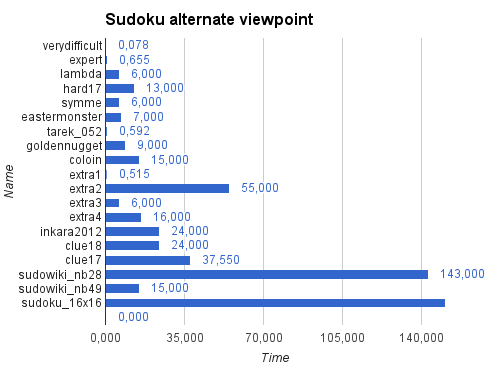
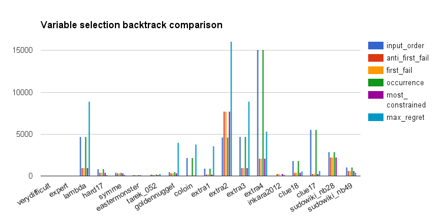

% Report: Advanced Programming Languages in Artificial Intelligence
% Pablo Bollansée [r0465328], Vincent Tanghe [r0294173]
% \today

# INTRODUCTION

Constraint Logic Programming (CLP) is an augmentation of the logic programming paradigm where relations between variables are specified with constraints.
It can be seen as an extension that brings relational arithmetic to Prolog.

For the course Advanced Programming Languages in Artificial Intelligence, we are given the opportunity to get real experience with some CLP languages.
The goal of this assignment is to get practical experience with different CLP languages and to get a deeper understanding in how they work.
This will be done by solving two different puzzle games with the languages two of three thought languages: _ECLiPSe_, _Constraint Handling Rules_ (_CHR_) and _Jess_.

First we will do a short discussion of the CLP languages, explaining which we chose and why.
We then discuss of our solver for the popular puzzle game Sudoku in both chosen languages, followed by a discussion our approach for solving Shikaku.
Finally we will end with a conclusion regarding the assignment as a whole.

# Constraint Programming languages

## ECLiPSE

_ECLiPSe_ is an Open-Source, Prolog-based system for the development and deployment of Constraint Programming applications.
It is largely backwards compatible with Prolog, which means that a large set of the Prolog libraries are still be available.
It also includes its own development environment _TkEclipse_, which includes some tools for debugging.
It also has a fairly active community, which means that questions asked on popular forums (e.g. StackOverflow) will get answered within a reasonable amount of time.

_ECLiPSe_ extends Prolog by providing a core language for specifying constraints and relations between variables.
It also introducing new data types and structures such as arrays and for-loops, which make the programming easier even though for-loops in a declarative language might seem weird.
It is declarative, easy to understand and it has a built-in search mechanism that supports many different parameters.
The running time, however, is highly dependent on the selected parameters (which define the heuristics used during the search).
Because of its slight differences with Prolog and the way it handles lists, it can be confusing for programmers that are new to the language.
Debugging can be a troublesome, as with any declarative language as there isn't always a clear path trough the code, however the _TkEclipse_ debugging tools relieve this problem a bit.

_ECLiPSe_ can be run using a more traditional command-line interface or a more interactive Graphical User Interface (GUI) tkeclipse.
But don't let the looks deceive you, the GUI works fairly well.

## CHR

Constraint Handling Rules (CHR) allows for multiple rules to be defined in a certain order to simplify and propagate of multi-relation sets.
It also allows you to define redundant rules that may further simplify the possibility space.
CHR consists of multiple head atoms, followed by guarded rules.

CHR is available in different languages, such as Java, Haskell and C.
However, we will use the recommended Prolog implementation (SWI-Prolog), which also means the SWI-Prolog editor and several Prolog libraries become available.
CHR is free to download and has some online tutorials.
Unfortunately, most of them refer to exactly the same examples.

## Jess

Jess is a rule engine for the Java platform. It has a GUI based on the open-source Eclipse IDE, which -in combination with friendly user-friendly error messages, should make the development easier. It is free for academic use, but a license is needed for commercial use. And it uses its own declarative XML language (JessML) which offers a lot of the Java perks, such as regular expressions and Java object manipulation.

However, the minor amount of available documentation, the trouble to get a working installation, the fact that it had not yet been introduced to us at the time of coding and the fact that it uses yet another language (JessML) instead of the already known Prolog syntax made Jess a less practical choice.
Besides these practicalities, we found that both Jess and CHR are good for expressing rules, but have a lesser support for search compared to _ECLiPSe_. We found that this is even worse for Jess, where delegating to host language (Java) is a common implementation.

## Which did we choose?

For this assignment we chose **ECLiPSE** and **CHR** to make our solvers in.
The main reasons for this are that ECLiPSE and CHR seem to have a superior amount of documentation and a more active community.

The course was mainly focused on **ECLiPSE** so this was an easy choice, as this allowed us to start working on the assignment much sooner.
Both **ECLiPSE** and **CHR** are also implemented on Prolog, which also makes working in both languages simultaneously much more enjoyable.

When looking at the puzzles we had to solve for this assignment, Sudoku and Shikaku, **ECLiPSE** has some very useful features:

* Both puzzles require some search, as there are no known set of constraints that can solve any puzzle, and ECLiPSE has very nice support for this with very powerful propagation support.
* The build-in array syntax gave a very natural way of reasoning about the constraints and specifying them.
* The for-loop support gave a very nice way to specify constraints on the cells
* The `ic` libary provided some very nice constraints (e.g. alldifferent)

There are however also some drawbacks:

* Some functions require grounded variables, and it is not always immediately clear which these are. ECLiPSe allows variables to have a domain, but Prolog doesn't always agree with this, which can be confusing at times.
* The required running time of a program can vary greatly on only slight changes in the code. As there is no way, to our knowledge, to see the propagation that is happening, nor are there any profiling tools, it is very hard to optimize and debug the constraints.

**CHR** is much more basic than ECLiPSE.
It requires much more to be hand-crafted.
However since it is implemented on Prolog you do get some very nice features.
Mainly backtracking is very useful during search, as this also backtracks the changes that happened in the  **CHR** constraint-store, allowing for a relatively easy way to implement a simple search strategy.
So any rules of a puzzle are easily implemented, however once search is required CHR is harder to use.

We didn't use **Jess** as this has the same problems as CHR, but doesn't have the nice features of Prolog and was only touched on very briefly at the end of the course.

# SUDOKU

## TASK-DESCRIPTION

Sudoku is a logic puzzle game.
It consists of a a 9 by 9 board, divided in 3 by 3 blocks.
Each cell must contain exactly one number between 1 and 9, and at the start some of these are filled in.
Each column, row and block must contain all different numbers, so it's up to the player to find a configuration that works within these constraints (without of course changing the given numbers).

An alternative version of Sudoku works on any N by N grid.
We implemented a version that supports any grid of `N = X^2`, where X is a whole number.
So for instance, we support grids of 16 by 16 and 25 by 25.
In the classic Sudoku there are 9 3 by 3 block (as seen on figure \ref{sudoku_board}), but in our case there are N X by X blocks.
We chose to do this alternative version as it also includes the _normal_ Sudoku, and gave our solution a nice extra dimension (pun intended).

In this part we will discuss the implementation of our solver for Sudoku in _ECLiPSe_ and CHR.

## VIEWPOINTS AND PROGRAMS

The __classical viewpoint__ for Sudoku is a simple 2D grid of numbers.
The rules of Sudoku then state that all numbers in a row must be different, that all numbers in a column must be different and that all numbers in a block must be different.
These are quite easy to define in _ECLiPSe_ (see later).
In this viewpoint, it comes down to mapping numbers to places.

For the __alternate viewpoint__ we propose a viewpoint where we map places, or coordinates, to the numbers.
For the classic Sudoku this means that there are 9 list of 9 coordinates, as there are 9 1's that need a place in the grid, 9 2's, ....
The rules of Sudoku are of course unchanged, however the constraints are specified slightly different for this viewpoints:
Each list must contain exactly one coordinate in each row, column, and block.
Also between lists no coordinate may exist twice.

To combine both viewpoints, we used __channeling__ by linking the board variables to both implementations.

## Eclipse implementations

### Normal view

Eclipse is very well suited for these kinds of problems.
The implementation reflects this, and is quite simple.
First we give each cell an initial domain, 1 to 9 (or 1 to N in our case).
Then, since the puzzles are already given as a grid of numbers, all we had to do was iterate over each row, column and block and add the `alldifferent` constraint from the `ic` library.
Eclipse has a very nice array syntax, so this was quite easy:

	( for(I,1,D), param(BoardArray,D) % D is the dimention of the board
	do
		Row is BoardArray[I,1..D],
		Col is BoardArray[1..D,I],
		alldifferent(Row),
		alldifferent(Col)
	).

Similarly we extract each block and add the `alldifferent` constaint.
All that's left then is starting the search.

### Alternative view

The implementation of the alternative view is very similar.
Here we use again a N by N grid, each row represents a number (which was N coordinated).
Each column represents the X coordinate, whereas the number in the array represents the Y coordinate.
Then again we use multiple `alldifferent` constraints to ensure that no numbers share spaces.

One more complex part was extracting the numbers for this view from the puzzle, and linking it to the variables.
Here we used the excellent `#=/3`.
This is a build-in that allows you to add an equality constraint based on a third boolean variable.
This works as follows:

    ( multifor([I,R,C], [1,1,1], [N,N,N]),
        param(BoardArray, Coordinates)
    do
        #=(BoardArray[R,C], I, B),
        #=(Coordinates[I,C], R, B)
    ).

The `BoardArray` is the puzzle (simple 2D array with numbers), where the `Coordinates` is our alternative view (2D array with the numbers representing Y coordinates).
This code basically makes sure than when a number on position `Row,Col` is equal to `I` in the puzzle, that the number on position `I,Col` is equal to `Row`.

### Channeling

To do channeling the constraints from both viewpoints need to be 'linked' to each other, so that if one variable's domain changes this can be propagated to the variables of the other viewpoint.
For our _ECLiPSe_ implementation this was very easy.
Both viewpoints' variables are already linked with the variables of the given puzzle, and constraints added on them.
The original view unifies their variables with those in the puzzle, where our alternative links them as described above.
This made it so that both viewpoints actually already are channeled to the puzzle.
To channel both viewpoints all we had to do was let them both add their constraints to the same puzzle and then let _ECLiPSe_ search on the combined variables.

## CHR implementation

### Normal View

The CHR implementation of Sudoku uses a `cell/2` CHR constraint to represent all cells.
The first variable is the position of the cell (X and Y coordinate) where the second is a list of possible values.
So at the start our program creates `N*N` cell constraints (81 for a 9 by 9 Sudoku), with either a list with all numbers from 1 to N, or a list with one number if it was given.
Then we start the search process, by creating a CHR constraint `propagate`.
This will activate our first-fail search implementation:

    propagate <=> search(2).

    first_fail @ search(N), cell((Row,Col), Vs) # passive
    <=> length(Vs, Len), Len =:= N | member(V, Vs), cell((Row,Col), [V]), propagate.

    search(N) <=> nb_getval(width, Width), N == Width | true.
    search(N) <=> NN is N + 1, search(NN).

It starts by looking for cells with 2 possible values and then selects one of those two to be tried out.
If there are no cells with 2 possible values left, it will look for a cell with 3 possible values, and so on.

We modeled the rules of Sudoku as CHR rules, that when fired, will just make the program fail.
So for instance, if the same value occurs twice on the same row:

    alldifferent_in_row @ cell((Row, ColA), [Value]), cell((Row,ColB), [Value]) # passive
        <=> ColA \= ColB | false.

This will cause the program to backtrack to our search (the `member\2` clause to be exact) and try a different number.
These are passive constraints as they are only used to check the current assignment of values.

Lastly we implemented some active propagation rules.
They check to see if there is a cell with a known number (so only one value is left in the list of possible values), and they check if there is another cell in the same row, column or block, and will remove that value from their possible values.
For instance, for rows:

    eliminate_in_row @ propagate, cell((Row,\_), [Value])
        \\ cell((Row,Col), [V1, V2 | Vs])
        <=> select(Value, [V1, V2 | Vs], NVs)
            | cell((Row, Col), NVs).

Note that the second cell must have at least two possible values, otherwise removing one might give us a cell without possible values.
If there are two cells in the same row with both the same value as only possibility, this will be caught by the other CHR rules.

### Alternative view

The alternative view is very similar.
Here we represent the variables as `rvc\2` ((row,value),colums).
However it required a bit more care, especially when creating the initial rvc constraints.
It's not easy to explain clearly without going in too much detail, but it should become clear when looking at the code.
If not, we guess that's what the oral examination is for.
Other than that, the code is very similar to the normal view.

### Channeling

In CHR the channeling wasn't as easy as in ECLiPSe.
It's a new file that includes the implementation of both views.
To channel both we added some extra constraint and rules.
The additional constraints are a `fix_rcv` and `remove_rcv`:

    fix_rcv(Row,Col,Val),
    cell((Row,Col), \_), rvc((Row,Val),\_)
    <=> cell((Row,Col), [Val]), rvc((Row,Val),[Col]).

So `fix_rcv` fixes the corresponding cell and rvc constraint to exact values.
The `remove_rcv` removes a possible value from the cell constraint, or a possible column from the rvc constraint.
`remove_rcv` requires a bit more code to handle all edge cases, so isn't shown here.

The rules from both views are both included, and slightly altered to make use of these new constraints.
We also included both search rules so it will first try either cell or rvc constraints with the smallest domain, before continuing the search in constraints with bigger domains.

## EXPERIMENTS SET-UP

To make the testing easier, we created a file "sudoku_eclipse_channeling" where the classical viewpoint, the alternate viewpoint and a combination using channeling can be called.
The file defines a method solve_all/0 which will loop over all the different Sudokus defined in the sudex_toledo, using default channeling method.
You can also solve a specific puzzle by using solve/2 using the puzzle name and model ('simple', 'alt' or 'both') as arguments.
Every time a solve method is called, the name of the method, name of the puzzle, running time, backtracks and solution is outputted.

*__Note:__ Since we implemented this to work for any NxN Sudokus we added two bigger Sudokus: a 16 by 16 and a 25 by 25 puzzle to the sudex_toledo file.*

## Discussion

### ECLiPSe

The first thing we noticed is that our alternate viewpoint is a lot slower than the first one.
It was even that much slower that the 25x25 Sudoku wouldn't be solved within a reasonable amount of time. (As show in the results on figure \ref{sudoku_clp_chart2})

Furthermore, we noticed that the channeling didn't help our primary viewpoint much to gain speed.
In fact, the primary viewpoint is faster than the channeling in all Sudokus except for Extra2.
We believe that ECLiPSe can do sufficient propagation on the primary viewpoint, and that adding the channeling with extra constraint only makes ECLiPSe waste time on doing more unnecessary propagation.
This leads to worse times for most puzzles, however Extra2 seems to gain a lot from this extra propagation.
We are unsure what exactly makes Extra2 special compared to the other problems.

Where we do see an improvement is in the number of needed backtrack.
Only the classical viewpoint needs backtracks, the alternative seems to be able to resolve everything using only shallow backtracks or none at all.
Of course the channeled version then also doesn't require backtracking.
This could mean that the constraints are stronger in the alternate viewpoint (and thus also with channeling), meaning that only the correct numbers are found for each cell.
But, it seems that this stronger propagation actually uses more time than just backtracking occasionally.

With _ECLiPSE_, there are a lot of search parameters that you can choose from.
The following are the possible variable selection strategies:
* _input order_: Variables are considered in the order that they were passed to the search predicate.
* _anti first fail_: Variables with the largest domain are prioritized.
* _first fail_ : Variables with the smallest domain are prioritized.
* _occurrence_: Variables that have the largest amount of constraints associated with them are prioritized.
* _most constrained_: Selects the variable with the smallest domain. If multiple of those exist, one with the most associated constraints is selected.
* _max regret_ : Selects the variables with the largest difference between the two smallest values in the domain.
* _smallest_ : Variables with the smallest elements in their domain are prioritized.
* _largest_: Variables with the largest elements in their domain are prioritized.

Besides selection strategies, there are also the following choice methods that we tested:
* _indomain_: Values are tried in order and failed values are *not* removed.
* _indomain max_: Values are tried in decreasing order and failed values are removed.
* _indomain middle_: Values are tried from the middle out and failed values are removed.
* _indomain min_: Values are tried in increasing order and failed values are removed.
* _indomain random_: Values are selected from the domain at random and failed values are removed.
* _indomain split_: Values are selected by splitting the domain and trying the lower half first and failed intervals are removed entirely.

There are also the reverse methods of above functions.
We did not test those as we assumed similar averaged results or results that are strongly dependent per puzzle.

To test which strategy gives us the best result, we decided to run them all on our primary implementation.
To get an apples-to-apples comparison, we selected one choice method (e.g. indomain) to test all variable selection (e.g. occurence) strategies and visa versa.

First we started by running all the variable selection strategies (all results are in included in extra 'txt' files in the results folder).
In figure \ref{variable_selection_comparison} you can see the overview of all selection options with their backtracks per Sudoku puzzle.
Option Smallest and Largest are not in this list because of their disproportional amount of backtracks (average: 1590133,33 backtracks).
We choose to visualize the backtracks because they are usually strongly correlated to the running time.

Based on these empirical results, we can already see the importance of these settings.
For example, at the chart where we compare the primary viewpoint with the channeling, we see that extra2 appears to be the most difficult chart.
But out of this experiment, we can say that it was not necessarily a more difficult puzzle, but rather the propagation order was bad for that puzzle.
For our application, the best selection methods are most_constraint, first_fail and anti_first_fail with an average of 957,17 backtracks.
The worst selection methods are smallest and largest, with an earlier noted amount of backtracks.

As mentioned previously, we also ran all the choice strategies (all results are in included in extra 'txt' files in the results folder).
In figure \ref{sudoku_choice_strategy_comparison} you can see the overview of all selection options with their backtracks per Sudoku puzzle.
For aesthetic reasons, we abbreviated indomain to ind in the chart legend.
For the default variable selection, we used occurrence.
In our previous result, we saw that it didn't give the best results.
Our reasoning is that there is more optimization possible in this strategy so there would be a bigger difference visible within our choice strategy results.

Again we see that there is a difference.
However, the difference is much smaller than with the variable selection strategies.
For our application, the best choice strategies are indomain, indomain_split and indomain_max with an average of 2544,11 backtracks.
The worst choice strategy is indomain_middle, with an average of 4067,89 backtracks.
We were a little surprised by this result, as we assumed the regular indomain would perform worse since it does not remove failed values.

We also ran these experiments in the alternate viewpoint.
However, there the difference in results was only up to 0,200 sec.
So we assume that the choice options do not make a difference in our alternate viewpoint and that the time difference has to do with other programs running at that time.
The reason that it does not affect the alternate viewpoint is probably because the alternate viewpoint does not have any backtracks.
Since the options are there to influence the propagation over backtracks, it makes sense that we do not see a difference.

### CHR

With CHR, the difference in results is much lower which allows all results to still be shown on one chart, as seen below:

We can immediately see that the results of CHR are a lot slower than those from _ECLiPSe_.
But, there are some exceptions where the alternative in CHR performs better (e.g. Clue 17).
We can see that the most difficult problems remain the same for both CHR and _ECLiPSe_ (e.g. sudowiki_nb28) and that in both cases the alternative outperforms the primary at extra2.
Because of the high amount of backtracks in _ECLiPSe_ and inferences in CHR, we assume this has to do with the order of the propagation being less favorable.

### Conclusion
A different viewpoint can have a different effect in both CHR and ECLiPSe dependent on its implementation.
The difference shows in the amount of backtracks and the overall performance.
These empirical results show a first parameter to consider a viewpoint good or bad.
If it gets better results without compromising for a later exponential increase in resource dependence, it should be considered rather good.  
However, to really consider whether a viewpoint is good or bad, we'd like took at more than just the results.
In our opinion, a viewpoint should also be intuitive to understand and expressed in compact but readable code.

Then, solely based on our experiments, we noticed that the implementation in _ECLiPSe_ is a lot faster than the CHR implementation.
However, we do not know whether this is inherit to the difference between _ECLiPSe_ and CHR, whether this is specific to this problem or whether we made implementation errors that should otherwise give the opposite result.
Furthermore, we saw that the combination with channeling is slower than CHR but only in one case faster than the _ECLiPSe_ implementation.

And as a finale note, we felt it was much easier to implement in _ECLiPSe_ rather than CHR.
_ECLiPSe_ really lends itself perfectly to these kinds of puzzles, where CHR requires a lot more work.

# SHIKAKU

## TASK-DESCRIPTION

Shikaku is a puzzle game where the board consists of a grid with in some cells a number.
To solve the puzzle, you need to transform each number into a rectangle with a surface that equals the number, so that none of the rectangles overlap and the whole board is filled.

The assignment stated that we had to create a single viewpoint.
However during the implementation we tried a second slightly different one as well, as we were not satisfied with the speed of our original viewpoint.

In this part we will discuss both viewpoints and the implementation of our solvers for Shikaku in _ECLiPSe_ and CHR.

## VIEWPOINTS AND PROGRAMS

The __classical viewpoint__ for Shikaku is one where all squares are defined by a top-left coordinate, a width and height.
They must be inside the grid, contain the number, have an area equal to that number and can't overlap.

As an __alternate viewpoint__ (alt) we propose a viewpoint where instead of a top-left coordinate, width and height, we define the top, left, bottom and right coordinate.
This viewpoint is very similar but, as we will show, can give much better results in term of speed.

## Redundant constraint

As per the assignment we introduced a redundant constraint to improve the solution.
In it's simplest form it is not needed to specify that each rectangle can only contain a single number.
Since rectangles can't overlap, and each rectangle contains one of those numbers, it is implied that each rectangle contains exactly one number.
So as an additional constraint we **explicitly** specify that each rectangle contains exactly one number, rather than implicitly through other constraints.

### _ECLiPSe_ implementation

As with Sudoku, _ECLiPSe_ lend itself very well to this problem.
We represented each rectangle as a X and Y coordinate for the upper left corner, and a Width and Height variable.
Since each hint will give rise to exactly one rectangle, we simply iterated over the given hints, and create a single rectangle for each.
Then it simply came down to defining the constraints which are all quite straightforward.

The grid is simply assumed to start at coordinate 1,1 and end in Width,Height.
Other than the constraints on the rectangles there is no real representation of the grid.

For the alternative view we represented the rectangles as 4 coordinates: Top, Left, Bottom, Right.
The constraints then had to be rewritten, but were conceptually the same.
The biggest difference was that, for this alternative view, constraints required less arithmetic.
Mainly because we already have the bottom right coordinate, whereas in the normal view we had to calculate is by adding width and height to the top left coordinate.
We believe this allowed _ECLiPSe_ to do better propagation, which could explain the overall performance gain.

### CHR implementation

We modeled this implementation pretty similar to the CHR implementation of Sudoku, whereas in Sudoku there was a list of possible coordinates while here we give a list of possible squares.
Or more concretely, we introduce two new constraints, `rect/2` and `rect/3` where `rect/2` contains as second argument a list of X and Y coordinates of the upper left corner in combination with its width and height.
First, a `rect/2` will be created for each given point, with a list of all possible that could fit at that position.
Then, the propagate constraint is initiated, which starts the propagation process where a possible rectangle from `rect/2` is proposed as a `rect/3`  constraint.

	propagate, rect(Point, Possible) #passive
	    <=>
	    member((Cor, Size),Possible), rect(Point,Cor,Size), propagate.

To prevent overlapping rectangles, we have constraints that passively check for overlaps between proposed `rect/3` or actively filter possible rectangles out of other `rect/2`.

For the alternate view, we introduced yet another constraint `rect/5` to represent the rectangles with the 4 coordinates as explained in the _ECLiPSe_ implementation.
However, we still contain the `rect/3` constraint to be able to use the nice print function that was proposed within the assignment for printing Shikaku.

## EXPERIMENTS SET-UP

The set-up is similar as in  the Sudoku set-up, however here we didn't do channeling (as normally there wouldn't even have been two viewpoints) and the puzzles are in a different file (puzzles.pl).
When opening the CHR or eclipse implementation in the correct GUI, the solve/1 or solve_all/0 predicates can be used to solve a specific or all puzzles respectively.

## DISCUSSION

Because the last 6 methods had the highest time values, we cut them off and put them in a table to keep the chart ratio.
By putting them in a table, we could add the backtracks or inferences respectively.

### _ECLiPSe_

Puzzle | Normal time (sec) | Normal backtracks | Alt time (sec) | Alt backtracks
-------|------------------:|------------------:|---------------:|---------------:
p(5,1) | 22,090            | 2913              | 0,109          | 0
p(5,2) | 124,551           | 11754             | 0,125          | 0
p(5,3) | 201,616           | 32366             | 0,078          | 0
p(5,4) | 5,085             | 555               | 0,125          | 0
p(5,5) | 350,956           | 25996             | 0,187          | 1
p(6,1) | 177,872           | 4330              | 0,297          | 0
Table: The last 6 results of Shikaku _ECLiPSe_ with the normal and the alternate viewpoint

We can see that the alternative view is much faster than the other methods. We can also see that it contains much less backtracks, which makes it seem that the constraints are tighter in the alternative model.
This is what we believe to be the main reason for the difference in speed.

Another reason for their difference in the search tree is that there are simply different values to be found.

In the Sudoku implementation, we also discussed a difference in search heuristics.
One of the results that seemed odd to us is the fact that the performance of the regular indomain was among the best.
Because of this reason, we tested indomain versus indomain_split within this problem.
And, as we expected, we can now clearly see that indomain_split gets better results with an average of 2410,21 backtracks while indomain got an average of 5544,64 backtracks.
We think that this difference became more apparent because there is a larger backtrack set to go over in this problem compared to the sudoku problem.

### _CHR_

Puzzle | Normal time (sec) | Normal inferences | Alt time (sec) | Alt inferences
-------|------------------:|------------------:|---------------:|---------------:
p(5,1) | 11,668            | 82 663 847        | 10,000         | 98 574 181
p(5,2) | 13,400            | 95 476 199        | 11,335         | 112 089 372
p(5,3) | 44,311            | 273 118 213       | 193,563        | 2 280 734 323
p(5,4) | 12,982            | 92 899 324        | 11,068         | 108 855 366
p(5,5) | 57,242            | 366 411 206       | 63,839         | 725 171 392
p(6,1) | 156,980           | 982 498 648       | 124,253        | 1 354 737 953
Table: The last 6 results of Shikaku CHR with the normal and the alternate viewpoint

Again, the CHR implementation is slower than the _ECLiPSe_, until we reach problem p(5,1) where we see that the CHR implementation is faster than the normal viewpoint of the _ECLiPSe_ implementation.

In CHR we also see that the alternative viewpoint is usually faster than the normal viewpoint.
However, it is interesting to see that in CHR the difference between the different viewpoints is **much** smaller!

Another interesting thing we notice, is that the amount of inferences does not necessary reflect the time needed.
A larger amount of inferences is usually in line with a longer time.
But we can see that the amount of inferences in the alternative seems higher while it does achieve lower times.

Besides these tests, we also attempted to add redundant constraints to see what effect this would have on the implementation.
We noticed that some give a clear speed advantage if they are able to make large search domain cuts.
Another redundant constraint that we added selects automatically the last possible option:

	last_of_list @ rect(Point,[(c(X1,Y1),s(W1,H1))])
		<=> rect(Point,c(X1,Y1),s(W1,H1)).

However, we can only see a slight increase of inferences with this constraint as it is yet another constraint to check and does not cut in the search domain.

### Conclusion

The difference a different viewpoint can make really flourishes in this example, as the different viewpoint in the _ECLiPSe_ implementation has a large speed increase.
The second viewpoint also keeps an intuitive approach and does not really complicate the code.
This, together with our empirical results, is why we would consider it a better viewpoint.

# EXTRA

While we didn't take one of the given options of the extra assignment, we did extend the given assignments:
- We implemented sudoku for dynamic dimensions (NxN) instead of the regular 9x9
- We implemented a different (and faster) viewpoint for Shikaku (as explained in the 4)

We did this because it came naturally during the development of our solution.
We found it a fun challenge to allow for more sizes of Sudoku, and the alternative viewpoint of Shikaku came from a desire to make a faster solution.

# CONCLUSION

We have experienced first-hand that debugging the CLP can be a challenge, but that the needed code remains surprisingly short without compromising for the readability.
We learned that different heuristics are strongly problem-dependent and can greatly influence the outcome speed.
This is something that we didn't take enough into account when we started the assignment, but became apparent as we did more experiments to explore the differences.
We learned that creating a different viewpoint, if not already better than the previous, can enlighten a new angle that improves the previous viewpoint.
And we learned that some counter-intuitive measures, like redundant rules can greatly improve the overall performance, which was especially visible in CHR where our own propagation is less advanced than in ECLiPSe.

In retrospect of the teamwork, we think that we managed to lower the workload by balancing our capacities.
We attempted to distribute the different aspects of the assignment and used peer-programming of one of us got stuck at a problem.
We tried to keep an even distribution over the languages so both of us got a taste of working with both implementations.

Overall, it was interesting to work with CLP languages and see the empirical results rather than the solely the theoretical.

# APPENDIX

We each spent about 50 hours on this assignment.
The implementation of Sudoku took longest, which is probably due to the lack of experience as we finished this assignment in chronological order.

The extra Sudoku puzzles we tested came from: http://www.planetsudoku.net
We used JavaScript code that can be executed in the console to easily get the Sudoku in the right format.
The JavaScript code can be found in the sudex_toledo.pl file.

TODO TODO TODO

Dingen die in de opgave stonden maar nog missen (bovenop andere TODO's in de tekst):

3.3.1:

* Active/passive: Van ons zijn active want wij gebruiken de ic library en niet suspend library (en mss ook omdat we "seach/6" maar kzen niet zeker of dat echt verschil maakt daarin, labering zou ook ok zijn denkik misschien mogelijk eventueel). Ma kweet niet goed hoe da te beschrijven in de tekst dan :P
	* Passive constraints zijn constraints die enkel gebruikt worden om te testen of een huidige toepassing van variabelen correct is
	* Active constraints geven ook aanleiding tot propagation, dus door het aanpassen van één variabele worden die cosntraints gepropagate naar andere
	* Wij hebben active constraints allemaal denkik, omdat we de ic library gebruiken die dit toe laat voor zover ik het begrijp :P --> wij gebruiken zo "#=" enal (met die #) die doen da precies :P

* Tests zonder en met extra redundant constraint en bespreek verschil (niet zo veel in eclipse zekers? :P) Voor zowel eclipse als CHR (CHR merkte da meer zekers? Daar is minder fancy propagation)

EXTRA:
Mss ook eens in eclipse "ic_global" importeren ipv gewoon "ic", maakt shit mss nog sneller :P
Of mss alleen: ":- import alldifferent/1 from ic_global."
