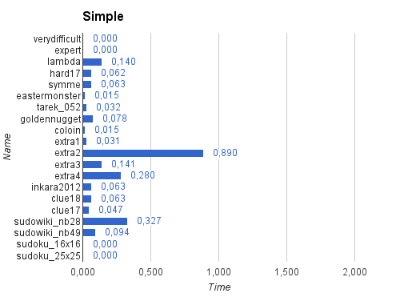

*__Note:__ This will be pasted in Word afterwards for layout-ing D:*
*__Note Pablo:__ Fuck that. Dees gewoon builden naar pdf met Pandoc, much nicer.*

Report
======
***Advanced Programming Languages in A.I.***

>Pablo Bollansée [r0465328]
>
>Vincent Tanghe	 [r0294173]

INTRODUCTION
------------

Constraint Logic Programming (CLP) is an augmentation of the logic programming paradigm where relations between variables are specified with constraints. It can be seen as an extension that brings relational arithmetic to Prolog.

For the course Avanced Programming Languages in Artificial Intelligence, we are given the opportunity to get real experience with some CLP languages. The goal of this assignment is to get practical experience with different CLP languages and to get a deeper understanding in how they work.

First we will discuss our solver for the popular puzzle game Sudoku. Then we will discuss our approach for solving Shikaku. Followed by a discussion of the extra assignment, to end with a conclusion.

TASK 1: SUDOKU
--------------

### TASK-DESCRIPTION
Sudoku is a logic puzzle game with a board that consists of a field with N x N blocks consisting of a x N grid. For example there a 3 by 3 blocks here all numbers from 1 to 9 should be filled in without doubles on the same lines in the whole grid.

In this part we will discuss the implementation of a solver for sudoku in *ECLiPSE* and CHR.

### VIEWPOINTS AND PROGRAMS
The classical viewpoint for Sudoku states that all numbers in a row must be different, that all numbers in a column must be different, and that all numbers in a block must be different. In this viewpoint, it comes down to mapping numbers to places.

We propose an alternate viewpoint where we map places, or coordinates, to the numbers. In this viewpoint, no coordinates can be double, each list should contain N coordinates (with N² being the width of the sudoku) and each list must contain a coordinate from each block of the field.

- practical implementation? -

### EXPERIMENTS SET-UP
To make the testing easier, we created a file "sudoku_eclipse_channeling" where the classical viewpoint, the alternate viewpoint and a combination using channeling can be called.
The file defines a method solve_all which/0 which will loop over all the different sudokus defined in the sudex_toledo, using default channeling method. You can also solve a specific puzzle by using solve/2 using the puzzle name and model (simple, alt or both) as arguments.
Every time a solve method is called, the name of the method, name of the puzzle, running time, backtracks and solution is outputted.

Besides using **ECLiPSE**, we also build a solver in **CHR** instead of **Jess**.
The superior amount of documentation, the fact that we had seen an introduction of CHR and the fact that it also uses SWI-prolog made it the most practical choice.
Besides these practicalities, we found that both Jess and CHR are good for expressing rules, but have a lesser support for search compared to *ECLiPSE*. And, we found that this is even worse for Jess, where delegating to host language (Java) is a common implementation.

*__Note:__ We implemented this to work for any NxN Sudokus. This was not obliged by the assignment but gave a nice extra dimension.*

### RESULTS
**ECLiPSE**

**CHR**

[some results D:]

### DISCUSSION
**The *ECLiPSE* implementation:**

We can see that the classical view is faster than the other methods. However, there is one puzzle where the power of channeling really does speed up the process.
We can also see that only the classical viewpoint uses backtracks.
It could also mean that the constraints are stronger in the alternate and with channeling, meaning that only the correct numbers are found for each cell. But, because of the long running times, we think that there could be ghost backtracks which are not captured by the program.

The **CHR** implementation:

**Conclusion**

The first thing we notice, solely based on our experiments, is that the implementation in *ECLiPSE* is way faster than the CHR implementation. The combination with channeling is slower than CHR but only in one case faster than the *ECLiPSE* implementation.

Personally, we felt it was easier to implement in *ECLiPSE* rather than CHR, but that may be due to our previous experience with Prolog.

TASK 2: SHIKAKU
---------------

### TASK-DESCRIPTION
Shikaku is a puzzle game where the board consists of a grid with some numbers filled in. To solve the puzzle, you need to transform each number into a square with a surface that equals the number, without overlap, until the whole board is filled.

### VIEWPOINTS AND PROGRAMS

### EXPERIMENTS SET-UP

### RESULTS

### DISCUSSION

TASK 3 (EXTRA)
--------------

### TASK-DESCRIPTION

### SET-UP

### RESULTS

### DISCUSSION

CONCLUSION
----------

[Strong points, Weak points, lessons learned]

APPENDIX
--------
We each spent about ^time^ on this assignment. The implementation of Sudoku took longest, which is probably due to the lack of experience as we finished this assignment in chronological order.

The extra Sudoku puzzles we tested came from: http://www.planetsudoku.net
